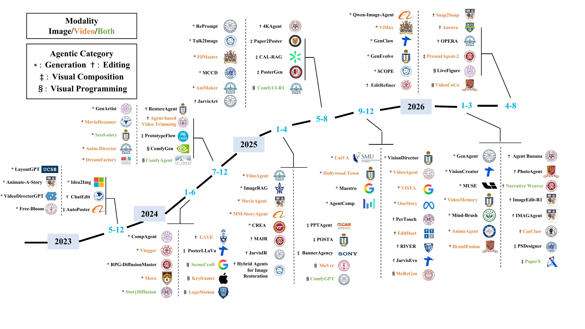

# Beyond Visual Generation: Frontiers, Challenges, and Future Directions in Agentic Visual Creation

Hefei Mei\*, Hangzhou He\*, Haiyi Qiu\*, Longrong Yang\*, Lunhao Duan\*, Shanshan Zhao†, Pengxin Zhan, Qing-Guo Chen, Zhao Xu, Weihua Luo

**A curated paper list for agentic visual creation**

## 📖 Abstract

Recent advances in image and video generation have improved visual quality and controllability, yet multi-stage creative tasks still require planning, coordination, and revision. Agentic visual creation plays a crucial role in bringing visual generation models into real-world creative workflows by using language or multimodal agents to coordinate generative models, editing tools, and creative software. This survey provides a structured overview to help researchers quickly understand the field, its representative approaches, and their connections. We organize existing work into four categories based on the agent’s main role in production: visual generation, visual editing, visual composition, and visual programming. Within each category, we compare how agents plan, use tools, maintain memory, incorporate feedback, and collaborate. We also review benchmark design, training data, and evaluation methods, with attention to feedback that supports revision. Finally, we discuss current limitations and future directions
toward more reliable and interactive visual creation systems. 

## 📜 Contents

- [🎨 Agentic Visual Generation](#agentic-visual-generation)
  - [🖼️ Target-Centered Visual Generation](#artifact-local-visual-generation)
  - [🤝 Coordinated Visual Generation](#coordinated-visual-generation)
- [✂️ Agentic Visual Editing](#agentic-visual-editing)
  - [🪄 Image Editing, Retouching, and Restoration](#image-editing-retouching-and-restoration)
  - [🎬 Video Editing, Remaking, Montage, and Summarization](#video-editing-remaking-montage-and-summarization)
- [🧩 Agentic Visual Composition](#agentic-visual-composition)
  - [📐 Graphic and Document Composition](#graphic-and-document-composition)
  - [🖥️ Presentation and Interface Composition](#presentation-and-interface-composition)
- [💻 Agentic Visual Programming](#agentic-visual-programming)
  - [🔄 Workflow-Based Visual Programming](#workflow-based-visual-programming)
  - [⌨️ Code-Driven Visual Programming](#code-driven-visual-programming)
- [📊 Data and Evaluation](#data-and-evaluation)
  - [🖼️ Image Data and Evaluation](#image-data-and-evaluation)
  - [🎬 Video Data and Evaluation](#video-data-and-evaluation)

## 🎨 Agentic Visual Generation

### 🖼️ Target-Centered Visual Generation

| Paper Title | Published | Venue | Link |
| --- | --- | --- | --- |
| GenRouter: Unified Workflow Routing for Agentic Image Generation | 2026-08 | arXiv | [PDF](https://arxiv.org/pdf/2608.16721) |
| Beyond Trial-and-Error: Agentic Optimization for Image-to-Video Adherence | 2026-08 | arXiv | [PDF](https://arxiv.org/pdf/2608.12290) |
| ToolArtist: Tool-Using Unified Multimodal Models for Agentic Image Generation | 2026-08 | arXiv | [PDF](https://arxiv.org/pdf/2608.04436) |
| Agentic Ontology-guided Image Generation and Evaluation for Rare-event Data Augmentation in Safety-critical Perception | 2026-07 | Array 2026 | [PDF](https://www.sciencedirect.com/science/article/pii/S2590005626002559?via%3Dihub) |
| Cognitive-structured Multimodal Agent for Multimodal Understanding, Generation, and Editing | 2026-07 | arXiv | [PDF](https://arxiv.org/pdf/2607.08497) |
| Search Beyond What Can Be Taught: Evolving the Knowledge Boundary in Agentic Visual Generation | 2026-07 | arXiv | [PDF](https://arxiv.org/pdf/2607.05382) |
| Bridging Creative Intent and Visual Quality: Creator-Driven Recurrent Video Generation with Agentic Feedback Loops | 2026-06 | ICML 2026 Workshop | [PDF](https://arxiv.org/pdf/2606.18591) |
| InterleaveThinker: Reinforcing Agentic Interleaved Generation | 2026-06 | arXiv | [PDF](https://arxiv.org/pdf/2606.13679) |
| MemoGen: Can Past Experience Improve Future Text-to-Image Generation? | 2026-06 | arXiv | [PDF](https://arxiv.org/pdf/2606.03243) |
| MetaPoint: Unlocking Precise Spatial Control in Agentic Visual Generation | 2026-06 | arXiv | [PDF](https://arxiv.org/pdf/2606.05031) |
| OctoT2I: A Self-Evolving Agentic Text-to-Image Router | 2026-06 | CVPR 2026 | [PDF](https://arxiv.org/pdf/2606.01803) |
| Qwen-Image-Agent: Bridging the Context Gap in Real-World Image Generation | 2026-06 | arXiv | [PDF](https://arxiv.org/pdf/2606.26907) |
| RS-Gen: A Multi-Stage Agentic Framework for Reasoning and Search-Augmented Image Generation | 2026-06 | arXiv | [PDF](https://arxiv.org/pdf/2606.23221) |
| VideoWeaver: Evaluating and Evolving Skills for Agentic Long Video Generation | 2026-06 | arXiv | [PDF](https://arxiv.org/pdf/2606.08091) |
| APE: Agentic Prompt Enhancer for Image Generation and Editing | 2026-05 | arXiv | [PDF](https://arxiv.org/pdf/2606.00204) |
| CogPortrait: Fine-Grained Eye-Region Control in Portrait Animation via Hierarchical Agent Planning | 2026-05 | arXiv | [PDF](https://arxiv.org/pdf/2605.28056) |
| GenClaw: Code-Driven Agentic Image Generation | 2026-05 | arXiv | [PDF](https://arxiv.org/pdf/2605.30248) |
| Generation Navigator: A State-Aware Agentic Framework for Image Generation | 2026-05 | arXiv | [PDF](https://arxiv.org/pdf/2605.17969) |
| GenEvolve: Self-Evolving Image Generation Agents via Tool-Orchestrated Visual Experience Distillation | 2026-05 | arXiv | [PDF](https://arxiv.org/pdf/2605.21605) |
| Genflow Ad Studio: A Compound AI Architecture for Brand-Aligned, Self-Correcting Video Generation | 2026-05 | CAIS 2026 | [PDF](https://arxiv.org/pdf/2605.16748) |
| KGEdit: Ambiguity-Aware Knowledge Graphs for Training-Free Precise Video Generation and Editing | 2026-05 | arXiv | [PDF](https://arxiv.org/pdf/2605.29509) |
| NEWTON: Agentic Planning for Physically Grounded Video Generation | 2026-05 | arXiv | [PDF](https://arxiv.org/pdf/2605.18396) |
| PhotoFlow: Agentic 3D Virtual Photography Missions | 2026-05 | arXiv | [PDF](https://arxiv.org/pdf/2605.23771) |
| SCOPE: Structured Decomposition and Conditional Skill Orchestration for Complex Image Generation | 2026-05 | arXiv | [PDF](https://arxiv.org/pdf/2605.08043) |
| When Cultures Move: Measuring and Improving Multicultural Text-to-Video Generation | 2026-05 | arXiv | [PDF](https://arxiv.org/pdf/2605.16716) |
| Self-Reasoning Agentic Framework for Narrative Product Grid-Collage Generation | 2026-04 | arXiv | [PDF](https://arxiv.org/pdf/2604.16958) |
| coDrawAgents: A Multi-Agent Dialogue Framework for Compositional Image Generation | 2026-03 | CVPR Findings 2026 | [PDF](https://arxiv.org/pdf/2603.12829) |
| GEMS: Agent-Native Multimodal Generation with Memory and Skills | 2026-03 | arXiv | [PDF](https://arxiv.org/pdf/2603.28088) |
| Narrative Weaver: Towards Controllable Long-Range Visual Consistency with Multi-Modal Conditioning | 2026-03 | CVPR 2026 | [PDF](https://arxiv.org/pdf/2603.06688) |
| Unify-Agent: A Unified Multimodal Agent for World-Grounded Image Synthesis | 2026-03 | arXiv | [PDF](https://arxiv.org/pdf/2603.29620) |
| Mind-Brush: Integrating Agentic Cognitive Search and Reasoning into Image Generation | 2026-02 | arXiv | [PDF](https://arxiv.org/pdf/2602.01756) |
| RAISE: Requirement-Adaptive Evolutionary Refinement for Training-Free Text-to-Image Alignment | 2026-02 | CVPR 2026 | [PDF](https://arxiv.org/pdf/2603.00483) |
| SIDiffAgent: Self-Improving Diffusion Agent | 2026-02 | arXiv | [PDF](https://arxiv.org/pdf/2602.02051) |
| 3D Space as a Scratchpad for Editable Text-to-Image Generation | 2026-01 | CVPR 2026 | [PDF](https://arxiv.org/pdf/2601.14602) |
| Agentic Retoucher for Text-To-Image Generation | 2026-01 | CVPR 2026 | [PDF](https://arxiv.org/pdf/2601.02046) |
| GenAgent: Scaling Text-to-Image Generation via Agentic Multimodal Reasoning | 2026-01 | arXiv | [PDF](https://arxiv.org/pdf/2601.18543) |
| AgentComp: From Agentic Reasoning to Compositional Mastery in Text-to-Image Models | 2025-12 | arXiv | [PDF](https://arxiv.org/pdf/2512.09081) |
| OneStory: Coherent Multi-Shot Video Generation with Adaptive Memory | 2025-12 | CVPR 2026 | [PDF](https://arxiv.org/pdf/2512.07802) |
| Rethinking Prompt Design for Inference-time Scaling in Text-to-Visual Generation | 2025-12 | CVPR 2026 | [PDF](https://arxiv.org/pdf/2512.03534) |
| STAGE: Storyboard-Anchored Generation for Cinematic Multi-shot Narrative | 2025-12 | CVPR 2026 | [PDF](https://arxiv.org/pdf/2512.12372) |
| VisionDirector: Vision-Language Guided Closed-Loop Refinement for Generative Image Synthesis | 2025-12 | CVPR 2026 | [PDF](https://arxiv.org/pdf/2512.19243) |
| UniVA: Universal Video Agent towards Open-Source Next-Generation Video Generalist | 2025-11 | arXiv | [PDF](https://arxiv.org/pdf/2511.08521) |
| SceneDecorator: Towards Scene-Oriented Story Generation with Scene Planning and Scene Consistency | 2025-10 | NeurIPS 2025 | [PDF](https://arxiv.org/pdf/2510.22994) |
| VISTA: A Test-Time Self-Improving Video Generation Agent | 2025-10 | CVPR 2026 | [PDF](https://arxiv.org/pdf/2510.15831) |
| Maestro: Self-Improving Text-to-Image Generation via Agent Orchestration | 2025-09 | arXiv | [PDF](https://arxiv.org/pdf/2509.10704) |
| Plot'n Polish: Zero-shot Story Visualization and Disentangled Editing with Text-to-Image Diffusion Models | 2025-09 | AAAI 2026 | [PDF](https://arxiv.org/pdf/2509.04446) |
| PromptEnhancer: Taming Your Rewriter for Text-to-Image Generation via Fine-Grained Reward | 2025-09 | CVPR 2026 | [PDF](https://openaccess.thecvf.com/content/CVPR2026/papers/Wang_PromptEnhancer_Taming_Your_Rewriter_for_Text-to-Image_Generation_via_Fine-Grained_Reward_CVPR_2026_paper.pdf) |
| PromptSculptor: Multi-Agent Based Text-to-Image Prompt Optimization | 2025-09 | EMNLP 2025 | [PDF](https://arxiv.org/pdf/2509.12446) |
| Talk2Image: A Multi-Agent System for Multi-Turn Image Generation and Editing | 2025-08 | AAAI 2026 | [PDF](https://arxiv.org/pdf/2508.06916) |
| T2I-Copilot: A Training-Free Multi-Agent Text-to-Image System for Enhanced Prompt Interpretation and Interactive Generation | 2025-07 | ICCV 2025 | [PDF](https://arxiv.org/pdf/2507.20536) |
| FairyGen: Storied Cartoon Video from a Single Child-Drawn Character | 2025-06 | SIGGRAPH Asia 2025 | [PDF](https://arxiv.org/pdf/2506.21272) |
| MCCD: Multi-Agent Collaboration-based Compositional Diffusion for Complex Text-to-Image Generation | 2025-05 | CVPR 2025 | [PDF](https://arxiv.org/pdf/2505.02648) |
| RePrompt: Reasoning-Augmented Reprompting for Text-to-Image Generation via Reinforcement Learning | 2025-05 | arXiv | [PDF](https://arxiv.org/pdf/2505.17540) |
| ShotAdapter: Text-to-Multi-Shot Video Generation with Diffusion Models | 2025-05 | CVPR 2025 | [PDF](https://arxiv.org/pdf/2505.07652) |
| CREA: A Collaborative Multi-Agent Framework for Creative Image Editing and Generation | 2025-04 | NeurIPS 2025 | [PDF](https://arxiv.org/pdf/2504.05306) |
| From Reflection to Perfection: Scaling Inference-Time Optimization for Text-to-Image Diffusion Models via Reflection Tuning | 2025-04 | ICCV 2025 | [PDF](https://arxiv.org/pdf/2504.16080) |
| MV-Crafter: An Intelligent System for Music-guided Video Generation | 2025-04 | ACM TIIS 2025 | [PDF](https://arxiv.org/pdf/2504.17267) |
| The Devil is in the Prompts: Retrieval-Augmented Prompt Optimization for Text-to-Video Generation | 2025-04 | CVPR 2025 | [PDF](https://arxiv.org/pdf/2504.11739) |
| Reflect-DiT: Inference-Time Scaling for Text-to-Image Diffusion Transformers via In-Context Reflection | 2025-03 | ICCV 2025 | [PDF](https://arxiv.org/pdf/2503.12271) |
| ImageRAG: Dynamic Image Retrieval for Reference-Guided Image Generation | 2025-02 | ICLR 2026 | [PDF](https://arxiv.org/pdf/2502.09411) |
| MotionAgent: Fine-grained Controllable Video Generation via Motion Field Agent | 2025-02 | ICCV 2025 | [PDF](https://arxiv.org/pdf/2502.03207) |
| FineRAG: Fine-grained Retrieval-Augmented Text-to-Image Generation | 2025-01 | COLING 2025 | [PDF](https://aclanthology.org/2025.coling-main.741.pdf) |
| GenMAC: Compositional Text-to-Video Generation with Multi-Agent Collaboration | 2024-12 | AAAI 2026 | [PDF](https://arxiv.org/pdf/2412.04440) |
| Llama Learns to Direct: DirectorLLM for Human-Centric Video Generation | 2024-12 | arXiv | [PDF](https://arxiv.org/pdf/2412.14484) |
| Motion by Queries: Identity-Motion Trade-offs in Text-to-Video Generation | 2024-12 | arXiv | [PDF](https://arxiv.org/pdf/2412.07750) |
| Proactive Agents for Multi-Turn Text-to-Image Generation Under Uncertainty | 2024-12 | ICML 2025 | [PDF](https://arxiv.org/pdf/2412.06771) |
| SILMM: Self-Improving Large Multimodal Models for Compositional Text-to-Image Generation | 2024-12 | CVPR 2025 | [PDF](https://arxiv.org/pdf/2412.05818) |
| VideoGen-of-Thought: Step-by-step generating multi-shot video with minimal manual intervention | 2024-12 | arXiv | [PDF](https://arxiv.org/pdf/2412.02259) |
| DreamRunner: Fine-Grained Compositional Story-to-Video Generation with Retrieval-Augmented Motion Adaptation | 2024-11 | AAAI 2026 | [PDF](https://arxiv.org/pdf/2411.16657) |
| Self-Correcting Text-to-Video Generation with Misalignment Detection and Localized Refinement | 2024-11 | ACL Findings 2026 | [PDF](https://arxiv.org/pdf/2411.15115) |
| SPAgent: Adaptive Task Decomposition and Model Selection for General Video Generation and Editing | 2024-11 | IEEE TIP 2026 | [PDF](https://arxiv.org/pdf/2411.18983) |
| Story-Iter: A Training-free Iterative Paradigm for Long Story Visualization | 2024-10 | ICLR 2026 | [PDF](https://arxiv.org/pdf/2410.06244) |
| Compositional 3D-aware Video Generation with LLM Director | 2024-08 | NeurIPS 2024 | [PDF](https://arxiv.org/pdf/2409.00558) |
| GenArtist: Multimodal LLM as an Agent for Unified Image Generation and Editing | 2024-07 | NeurIPS 2024 | [PDF](https://arxiv.org/pdf/2407.05600) |
| MovieDreamer: Hierarchical Generation for Coherent Long Visual Sequence | 2024-07 | ICLR 2025 | [PDF](https://arxiv.org/pdf/2407.16655) |
| SEED-Story: Multimodal Long Story Generation with Large Language Model | 2024-07 | ICCV 2025 | [PDF](https://arxiv.org/pdf/2407.08683) |
| VideoTetris: Towards Compositional Text-to-Video Generation | 2024-06 | NeurIPS 2024 | [PDF](https://arxiv.org/pdf/2406.04277) |
| StoryDiffusion: Consistent Self-Attention for Long-Range Image and Video Generation | 2024-05 | NeurIPS 2024 | [PDF](https://arxiv.org/pdf/2405.01434) |
| Dynamic Prompt Optimizing for Text-to-Image Generation | 2024-04 | CVPR 2024 | [PDF](https://arxiv.org/pdf/2404.04095) |
| DiffAgent: Fast and Accurate Text-to-Image API Selection with Large Language Model | 2024-03 | CVPR 2024 | [PDF](https://arxiv.org/pdf/2404.01342) |
| DivCon: Divide and Conquer for Complex Numerical and Spatial Reasoning in Text-to-Image Generation | 2024-03 | ECAI 2025 | [PDF](https://arxiv.org/pdf/2403.06400) |
| Mora: Enabling Generalist Video Generation via A Multi-Agent Framework | 2024-03 | arXiv | [PDF](https://arxiv.org/pdf/2403.13248) |
| MuLan: Multimodal-LLM Agent for Progressive and Interactive Multi-Object Diffusion | 2024-02 | arXiv | [PDF](https://arxiv.org/pdf/2402.12741) |
| DiffusionAgent: Navigating Expert Models for Agentic Image Generation | 2024-01 | arXiv | [PDF](https://arxiv.org/pdf/2401.10061) |
| Divide and Conquer: Language Models can Plan and Self-Correct for Compositional Text-to-Image Generation | 2024-01 | arXiv | [PDF](https://arxiv.org/pdf/2401.15688) |
| Mastering Text-to-Image Diffusion: Recaptioning, Planning, and Generating with Multimodal LLMs | 2024-01 | ICML 2024 | [PDF](https://arxiv.org/pdf/2401.11708) |
| VideoStudio: Generating Consistent-Content and Multi-Scene Videos | 2024-01 | ECCV 2024 | [PDF](https://arxiv.org/pdf/2401.01256) |
| Vlogger: Make Your Dream A Vlog | 2024-01 | CVPR 2024 | [PDF](https://arxiv.org/pdf/2401.09414) |
| MEVG: Multi-event Video Generation with Text-to-Video Models | 2023-12 | ECCV 2024 | [PDF](https://arxiv.org/pdf/2312.04086) |
| StoryGPT-V: Large Language Models as Consistent Story Visualizers | 2023-12 | CVPR 2025 | [PDF](https://arxiv.org/pdf/2312.02252) |
| DreamSync: Aligning Text-to-Image Generation with Image Understanding Feedback | 2023-11 | NAACL 2025 | [PDF](https://arxiv.org/pdf/2311.17946) |
| FlowZero: Zero-Shot Text-to-Video Synthesis with LLM-Driven Dynamic Scene Syntax | 2023-11 | arXiv | [PDF](https://arxiv.org/pdf/2311.15813) |
| Ranni: Taming Text-to-Image Diffusion for Accurate Instruction Following | 2023-11 | CVPR 2024 | [PDF](https://arxiv.org/pdf/2311.17002) |
| Self-correcting LLM-controlled Diffusion Models | 2023-11 | CVPR 2024 | [PDF](https://arxiv.org/pdf/2311.16090) |
| Idea2Img: Iterative Self-Refinement with GPT-4V(ision) for Automatic Image Design and Generation | 2023-10 | ECCV 2024 | [PDF](https://www.ecva.net/papers/eccv_2024/papers_ECCV/papers/05515.pdf) |
| Free-Bloom: Zero-Shot Text-to-Video Generator with LLM Director and LDM Animator | 2023-09 | NeurIPS 2023 | [PDF](https://arxiv.org/pdf/2309.14494) |
| LLM-grounded Video Diffusion Models | 2023-09 | ICLR 2024 | [PDF](https://arxiv.org/pdf/2309.17444) |
| VideoDirectorGPT: Consistent Multi-scene Video Generation via LLM-Guided Planning | 2023-09 | COLM 2024 | [PDF](https://arxiv.org/pdf/2309.15091) |
| LayoutLLM-T2I: Eliciting Layout Guidance from LLM for Text-to-Image Generation | 2023-08 | ACM MM 2023 | [PDF](https://arxiv.org/pdf/2308.05095) |
| Animate-A-Story: Storytelling with Retrieval-Augmented Video Generation | 2023-07 | ECCVW 2024 | [PDF](https://arxiv.org/pdf/2307.06940) |
| DirecT2V: Large Language Models are Frame-Level Directors for Zero-Shot Text-to-Video Generation | 2023-05 | arXiv | [PDF](https://arxiv.org/pdf/2305.14330) |
| LayoutGPT: Compositional Visual Planning and Generation with Large Language Models | 2023-05 | NeurIPS 2023 | [PDF](https://arxiv.org/pdf/2305.15393) |
| LLM-grounded Diffusion: Enhancing Prompt Understanding of Text-to-Image Diffusion Models with Large Language Models | 2023-05 | TMLR 2024 | [PDF](https://arxiv.org/pdf/2305.13655) |

### 🤝 Coordinated Visual Generation

| Paper Title | Published | Venue | Link |
| --- | --- | --- | --- |
| FilmWorld: Agentic Novel-to-Film Generation through Dynamic Cinematic World Modeling | 2026-07 | arXiv | [PDF](https://arxiv.org/pdf/2607.19038) |
| SimWorlds: A Multi-Agent System for Dynamic 3D Scene Creation | 2026-07 | arXiv | [PDF](https://arxiv.org/pdf/2607.01766) |
| GroundShot: Visually Consistent Multi-Shot Long Video Generation via Entity-Grounded Shot Scheduling | 2026-06 | arXiv | [PDF](https://arxiv.org/pdf/2606.20799) |
| MUSE: Agentic 3D Scene Authoring via Memory-Grounded Incremental Requirement Satisfaction | 2026-06 | arXiv | [PDF](https://arxiv.org/pdf/2606.14168) |
| ViMax: Agentic Video Generation | 2026-06 | arXiv | [PDF](https://arxiv.org/pdf/2606.07649) |
| A²RD: Agentic Autoregressive Diffusion for Long Video Consistency | 2026-05 | arXiv | [PDF](https://arxiv.org/pdf/2605.06924) |
| One Sentence, One Drama: Personalized Short-Form Drama Generation via Multi-Agent Systems | 2026-05 | arXiv | [PDF](https://arxiv.org/pdf/2605.22144) |
| S2ED: From Story to Executable Descriptions for Consistency-Aware Story Illustration | 2026-05 | ICME 2026 | [PDF](https://arxiv.org/pdf/2605.22448) |
| Authoring for Living Worlds: Tool-Constrained LLM Agents for Executable Multi-Actor Scenarios | 2026-04 | arXiv | [PDF](https://arxiv.org/pdf/2604.10383) |
| BOOKAGENT: Orchestrating Safety-Aware Visual Narratives via Multi-Agent Cognitive Calibration | 2026-04 | ACL Findings 2026 | [PDF](https://arxiv.org/pdf/2604.16541) |
| CineAGI: Character-Consistent Movie Creation through LLM-Orchestrated Multi-Modal Generation and Cross-Scene Integration | 2026-04 | ICME 2026 | [PDF](https://arxiv.org/pdf/2604.23579) |
| Co-Director: Agentic Generative Video Storytelling | 2026-04 | arXiv | [PDF](https://arxiv.org/pdf/2604.24842) |
| Sima 1.0: A Collaborative Multi-Agent Framework for Documentary Video Production | 2026-04 | arXiv | [PDF](https://arxiv.org/pdf/2604.07721) |
| BrandFusion: A Multi-Agent Framework for Seamless Brand Integration in Text-to-Video Generation | 2026-03 | CVPR Findings 2026 | [PDF](https://arxiv.org/pdf/2603.02816) |
| VisionCreator: A Native Visual-Generation Agentic Model with Understanding, Thinking, Planning and Creation | 2026-03 | arXiv | [PDF](https://arxiv.org/pdf/2603.02681) |
| AnimeAgent: Is the Multi-Agent via Image-to-Video models a Good Disney Storytelling Artist? | 2026-02 | arXiv | [PDF](https://arxiv.org/pdf/2602.20664) |
| Beyond End-to-End Video Models: An LLM-Based Multi-Agent System for Educational Video Generation | 2026-02 | KDD 2026 | [PDF](https://arxiv.org/pdf/2602.11790) |
| MUSE: A Multi-agent Framework for Unconstrained Story Envisioning via Closed-Loop Cognitive Orchestration | 2026-02 | arXiv | [PDF](https://arxiv.org/pdf/2602.03028) |
| The Script is All You Need: An Agentic Framework for Long-Horizon Dialogue-to-Cinematic Video Generation | 2026-01 | arXiv | [PDF](https://arxiv.org/pdf/2601.17737) |
| VideoMemory: Toward Consistent Video Generation via Memory Integration | 2026-01 | arXiv | [PDF](https://arxiv.org/pdf/2601.03655) |
| AutoMV: An Automatic Multi-Agent System for Music Video Generation | 2025-12 | arXiv | [PDF](https://arxiv.org/pdf/2512.12196) |
| CoAgent: Collaborative Planning and Consistency Agent for Coherent Video Generation | 2025-12 | arXiv | [PDF](https://arxiv.org/pdf/2512.22536) |
| PosterCopilot: Toward Layout Reasoning and Controllable Editing for Professional Graphic Design | 2025-12 | arXiv | [PDF](https://arxiv.org/pdf/2512.04082) |
| AnimAgents: Coordinating Multi-Stage Animation Pre-Production with Human-Multi-Agent Collaboration | 2025-11 | arXiv | [PDF](https://arxiv.org/pdf/2511.17906) |
| Code2Video: A Code-centric Paradigm for Educational Video Generation | 2025-10 | arXiv | [PDF](https://arxiv.org/pdf/2510.01174) |
| Hollywood Town: Long-Video Generation via Cross-Modal Multi-Agent Orchestration | 2025-10 | arXiv | [PDF](https://arxiv.org/pdf/2510.22431) |
| VideoAgent: Personalized Synthesis of Scientific Videos | 2025-09 | ICMR 2026 | [PDF](https://arxiv.org/pdf/2509.11253) |
| AniME: Adaptive Multi-Agent Planning for Long Animation Generation | 2025-08 | SIGGRAPH Asia 2025 Posters | [PDF](https://arxiv.org/pdf/2508.18781) |
| MAViS: A Multi-Agent Framework for Long-Sequence Video Storytelling | 2025-08 | EACL 2026 | [PDF](https://arxiv.org/pdf/2508.08487) |
| Preacher: Paper-to-Video Agentic System | 2025-08 | ICCV 2025 | [PDF](https://arxiv.org/pdf/2508.09632) |
| AniMaker: Multi-Agent Animated Storytelling with MCTS-Driven Clip Generation | 2025-06 | SIGGRAPH Asia 2025 | [PDF](https://arxiv.org/pdf/2506.10540) |
| Audit & Repair: An Agentic Framework for Consistent Story Visualization in Text-to-Image Diffusion Models | 2025-06 | arXiv | [PDF](https://arxiv.org/pdf/2506.18900) |
| FilMaster: Bridging Cinematic Principles and Generative AI for Automated Film Generation | 2025-06 | arXiv | [PDF](https://arxiv.org/pdf/2506.18899) |
| Script2Screen: Supporting Dialogue-Centric Scriptwriting with Interactive Audiovisual Generation | 2025-04 | IUI 2026 | [PDF](https://arxiv.org/pdf/2504.14776) |
| Stealing Creator's Workflow: A Creator-Inspired Agentic Framework with Iterative Feedback Loop for Improved Scientific Short-form Generation | 2025-04 | arXiv | [PDF](https://arxiv.org/pdf/2504.18805) |
| Automated Movie Generation via Multi-Agent CoT Planning | 2025-03 | arXiv | [PDF](https://arxiv.org/pdf/2503.07314) |
| Long-Video Audio Synthesis with Multi-Agent Collaboration | 2025-03 | arXiv | [PDF](https://arxiv.org/pdf/2503.10719) |
| MM-StoryAgent: Immersive Narrated Storybook Video Generation with a Multi-Agent Paradigm across Text, Image and Audio | 2025-03 | arXiv | [PDF](https://arxiv.org/pdf/2503.05242) |
| FilmAgent: A Multi-Agent Framework for End-to-End Film Automation in Virtual 3D Spaces | 2025-01 | arXiv | [PDF](https://arxiv.org/pdf/2501.12909) |
| StoryAgent: Customized Storytelling Video Generation via Multi-Agent Collaboration | 2024-11 | arXiv | [PDF](https://arxiv.org/pdf/2411.04925) |
| Anim-Director: A Large Multimodal Model Powered Agent for Controllable Animation Video Generation | 2024-08 | SIGGRAPH Asia 2024 | [PDF](https://arxiv.org/pdf/2408.09787) |
| DreamFactory: Pioneering Multi-Scene Long Video Generation with a Multi-Agent Framework | 2024-08 | arXiv | [PDF](https://arxiv.org/pdf/2408.11788) |
| Kubrick: Multimodal Agent Collaborations for Synthetic Video Generation | 2024-08 | CVPRW 2025 | [PDF](https://arxiv.org/pdf/2408.10453) |
| AutoStudio: Crafting Consistent Subjects in Interactive Story Generation | 2024-06 | CVPRW 2026 | [PDF](https://openaccess.thecvf.com/content/CVPR2026W/AISTORY/papers/Cheng_AutoStudio_Crafting_Consistent_Subjects_in_Interactive_Story_Generation_CVPRW_2026_paper.pdf) |
| TheaterGen: Character Management with LLM for Consistent Multi-turn Image Generation | 2024-04 | arXiv | [PDF](https://arxiv.org/pdf/2404.18919) |
| AutoStory: Generating Diverse Storytelling Images with Minimal Human Effort | 2023-11 | IJCV 2025 | [PDF](https://arxiv.org/pdf/2311.11243) |
| TaleCrafter: Interactive Story Visualization with Multiple Characters | 2023-05 | SIGGRAPH Asia 2023 | [PDF](https://arxiv.org/pdf/2305.18247) |

## ✂️ Agentic Visual Editing

### 🪄 Image Editing, Retouching, and Restoration

| Paper Title | Published | Venue | Link |
| --- | --- | --- | --- |
| Domain-Grounded Candidate Selection for Agentic Image Editing: A Shadow Removal Case | 2026-08 | arXiv | [PDF](https://arxiv.org/pdf/2608.06075) |
| GMO-E²DIT: Grounded Multi-Operation Editing for E-Commerce Images | 2026-07 | arXiv | [PDF](https://arxiv.org/pdf/2607.00920) |
| Self-Evolving Agentic Image Restoration via Deliberate Planning and Intuitive Execution | 2026-06 | arXiv | [PDF](https://arxiv.org/pdf/2606.28971) |
| EditRefiner: A Human-Aligned Agentic Framework for Image Editing Refinement | 2026-05 | arXiv | [PDF](https://arxiv.org/pdf/2605.07457) |
| From Plans to Pixels: Learning to Plan and Orchestrate for Open-Ended Image Editing | 2026-05 | arXiv | [PDF](https://arxiv.org/pdf/2605.15181) |
| OPERA: An Agent for Image Restoration with End-to-End Joint Planning-Execution Optimization | 2026-05 | arXiv | [PDF](https://arxiv.org/pdf/2605.22104) |
| CAMEO: A Conditional and Quality-Aware Multi-Agent Image Editing Orchestrator | 2026-04 | arXiv | [PDF](https://arxiv.org/pdf/2604.03156) |
| ImageEdit-R1: Boosting Multi-Agent Image Editing via Reinforcement Learning | 2026-03 | arXiv | [PDF](https://arxiv.org/pdf/2603.08059) |
| MSRAMIE: Multimodal Structured Reasoning Agent for Multi-instruction Image Editing | 2026-03 | arXiv | [PDF](https://arxiv.org/pdf/2603.16967) |
| Agent Banana: High-Fidelity Image Editing with Agentic Thinking and Tooling | 2026-02 | arXiv | [PDF](https://arxiv.org/pdf/2602.09084) |
| IMAGAgent: Orchestrating Multi-Turn Image Editing via Constraint-Aware Planning and Reflection | 2026-02 | arXiv | [PDF](https://arxiv.org/pdf/2603.29602) |
| PhotoAgent: Agentic Photo Editing with Exploratory Visual Aesthetic Planning | 2026-02 | ICML 2026 | [PDF](https://arxiv.org/pdf/2602.22809) |
| JarvisEvo: Towards a Self-Evolving Photo Editing Agent with Synergistic Editor-Evaluator Optimization | 2025-11 | CVPR 2026 | [PDF](https://arxiv.org/pdf/2511.23002) |
| MIRA: Multimodal Iterative Reasoning Agent for Image Editing | 2025-11 | CVPR Findings 2026 | [PDF](https://openaccess.thecvf.com/content/CVPR2026F/papers/Zeng_MIRA_Multimodal_Iterative_Reasoning_Agent_for_Image_Editing_CVPRF_2026_paper.pdf) |
| PerTouch: VLM-Driven Agent for Personalized and Semantic Image Retouching | 2025-11 | AAAI 2026 | [PDF](https://arxiv.org/pdf/2511.12998) |
| PSBench: Editing Image via GUI Agents in Photoshop | 2025-09 | ICML 2026 | [PDF](https://openreview.net/pdf/3cfbda4892e57041388c9387eb10b616bbe6603b.pdf) |
| 4KAgent: Agentic Any Image to 4K Super-Resolution | 2025-07 | NeurIPS 2025 | [PDF](https://arxiv.org/pdf/2507.07105) |
| JarvisArt: Liberating Human Artistic Creativity via an Intelligent Photo Retouching Agent | 2025-06 | NeurIPS 2025 | [PDF](https://arxiv.org/pdf/2506.17612) |
| JarvisIR: Elevating Autonomous Driving Perception with Intelligent Image Restoration | 2025-04 | CVPR 2025 | [PDF](https://arxiv.org/pdf/2504.04158) |
| Hybrid Agents for Image Restoration | 2025-03 | CVPR 2026 | [PDF](https://arxiv.org/pdf/2503.10120) |
| Multi-Agent Image Restoration | 2025-03 | IJCV 2026 | [PDF](https://arxiv.org/pdf/2503.09403) |
| An Intelligent Agentic System for Complex Image Restoration Problems | 2024-10 | ICLR 2025 | [PDF](https://arxiv.org/pdf/2410.17809) |
| RestoreAgent: Autonomous Image Restoration Agent via Multimodal Large Language Models | 2024-07 | NeurIPS 2024 | [PDF](https://arxiv.org/pdf/2407.18035) |
| CHATEDIT: Towards Multi-turn Interactive Facial Image Editing via Dialogue | 2023-03 | EMNLP 2023 | [PDF](https://arxiv.org/pdf/2303.11108) |
| Crafting a Toolchain for Image Restoration by Deep Reinforcement Learning | 2018-04 | CVPR 2018 | [PDF](https://arxiv.org/pdf/1804.03312) |

### 🎬 Video Editing, Remaking, Montage, and Summarization

| Paper Title | Published | Venue | Link |
| --- | --- | --- | --- |
| Crayotter: Learning Long-Horizon Video Editing Agents via Group-Relative Preference Backpropagation | 2026-08 | arXiv | [PDF](https://arxiv.org/pdf/2608.02694) |
| VideoAgent: All-in-One Framework for Video Understanding and Editing | 2026-06 | arXiv | [PDF](https://arxiv.org/pdf/2606.23327) |
| Aurora: Unified Video Editing with a Tool-Using Agent | 2026-05 | arXiv | [PDF](https://arxiv.org/pdf/2605.18748) |
| Crayotter: Traceable Multi-Agent Workflows for Long-Form Video Editing | 2026-05 | arXiv | [PDF](https://arxiv.org/pdf/2606.07636) |
| Soap2Soap: Long Cinematic Video Remaking via Multi-Agent Collaboration | 2026-05 | arXiv | [PDF](https://arxiv.org/pdf/2605.17423) |
| A Benchmark and Multi-Agent System for Instruction-driven Cinematic Video Compilation | 2026-04 | arXiv | [PDF](https://arxiv.org/pdf/2604.10456) |
| DIRECT: Video Mashup Creation via Hierarchical Multi-Agent Planning and Intent-Guided Editing | 2026-04 | arXiv | [PDF](https://arxiv.org/pdf/2604.04875) |
| GLANCE: A Global-Local Coordination Multi-Agent Framework for Music-Grounded Non-Linear Video Editing | 2026-04 | arXiv | [PDF](https://arxiv.org/pdf/2604.05076) |
| CutClaw: Agentic Hours-Long Video Editing via Music Synchronization | 2026-03 | arXiv | [PDF](https://arxiv.org/pdf/2603.29664) |
| Text-Driven Reasoning Video Editing via Reinforcement Learning on Digital Twin Representations | 2025-11 | arXiv | [PDF](https://arxiv.org/pdf/2511.14100) |
| Prompt-Driven Agentic Video Editing System: Autonomous Comprehension of Long-Form, Story-Driven Media | 2025-09 | arXiv | [PDF](https://arxiv.org/pdf/2509.16811) |
| EditDuet: A Multi-Agent System for Video Non-Linear Editing | 2025-08 | SIGGRAPH 2025 | [PDF](https://arxiv.org/pdf/2509.10761) |
| DIAMOND: An LLM-Driven Agent for Context-Aware Baseball Highlight Summarization | 2025-06 | REALM 2025 | [PDF](https://arxiv.org/pdf/2506.02351) |
| Agent-based Video Trimming | 2024-12 | arXiv | [PDF](https://arxiv.org/pdf/2412.09513) |
| VideoGUI: A Benchmark for GUI Automation from Instructional Videos | 2024-06 | NeurIPS 2024 | [PDF](https://arxiv.org/pdf/2406.10227) |
| LAVE: LLM-Powered Agent Assistance and Language Augmentation for Video Editing | 2024-02 | IUI 2024 | [PDF](https://arxiv.org/pdf/2402.10294) |

## 🧩 Agentic Visual Composition

### 📐 Graphic and Document Composition

| Paper Title | Published | Venue | Link |
| --- | --- | --- | --- |
| PosterMELD: Multi-Agent Paper-to-Poster Generation for Controllable Design Diversity with Editable Print-Ready Outputs | 2026-08 | arXiv | [PDF](https://arxiv.org/pdf/2608.02218) |
| Any2Poster: Any-Source Poster Generation Across Modalities and Domains | 2026-06 | arXiv | [PDF](https://arxiv.org/pdf/2606.02915) |
| PSDesigner: Automated Graphic Design with a Human-Like Creative Workflow | 2026-03 | CVPR 2026 | [PDF](https://arxiv.org/pdf/2603.25738) |
| EvoDiagram: Agentic Editable Diagram Creation via Design Expertise Evolution | 2026-02 | arXiv | [PDF](https://arxiv.org/pdf/2604.09568) |
| SciFig: Towards Automating Editable Figure Generation for Scientific Papers | 2026-01 | arXiv | [PDF](https://arxiv.org/pdf/2601.04390) |
| PosterGen: Aesthetic-Aware Multi-Modal Paper-to-Poster Generation via Multi-Agent LLMs | 2025-08 | CVPR Findings 2026 | [PDF](https://openaccess.thecvf.com/content/CVPR2026F/papers/Zhang_PosterGen_Aesthetic-Aware_Multi-Modal_Paper-to-Poster_Generation_Via_Multi-Agent_LLMs_CVPRF_2026_paper.pdf) |
| CAL-RAG: Retrieval-Augmented Multi-Agent Generation for Content-Aware Layout Design | 2025-06 | arXiv | [PDF](https://arxiv.org/pdf/2506.21934) |
| Paper2Poster: Towards Multimodal Poster Automation from Scientific Papers | 2025-05 | NeurIPS 2025 | [PDF](https://arxiv.org/pdf/2505.21497) |
| BannerAgency: Advertising Banner Design with Multimodal LLM Agents | 2025-03 | EMNLP 2025 | [PDF](https://aclanthology.org/2025.emnlp-main.214.pdf) |
| POSTA: A Go-to Framework for Customized Artistic Poster Generation | 2025-03 | CVPR 2025 | [PDF](https://openaccess.thecvf.com/content/CVPR2025/papers/Chen_POSTA_A_Go-to_Framework_for_Customized_Artistic_Poster_Generation_CVPR_2025_paper.pdf) |
| PosterLLaVa: Constructing a Unified Multi-modal Layout Generator with LLM | 2024-06 | arXiv | [PDF](https://arxiv.org/pdf/2406.02884) |
| AutoPoster: A Highly Automatic and Content-aware Design System for Advertising Poster Generation | 2023-08 | ACM MM 2023 | [PDF](https://arxiv.org/pdf/2308.01095) |

### 🖥️ Presentation and Interface Composition

| Paper Title | Published | Venue | Link |
| --- | --- | --- | --- |
| SeaSlides: Semantic Abstraction Layer for Agentic Slide Generation | 2026-08 | arXiv | [PDF](https://arxiv.org/pdf/2608.03298) |
| OmniPresent: Generating Coherent Presentation Suites from Scientific Papers | 2026-07 | arXiv | [PDF](https://arxiv.org/pdf/2607.02590) |
| MemSlides: A Hierarchical Memory Driven Agent Framework for Personalized Slide Generation with Multi-turn Local Revision | 2026-06 | arXiv | [PDF](https://arxiv.org/pdf/2606.17162) |
| PresentAgent-2: Towards Generalist Multimodal Presentation Agents | 2026-05 | arXiv | [PDF](https://arxiv.org/pdf/2605.11363) |
| GameUIAgent: An LLM-Powered Framework for Automated Game UI Design with Structured Intermediate Representation | 2026-03 | arXiv | [PDF](https://arxiv.org/pdf/2603.14724) |
| DeepPresenter: Environment-Grounded Reflection for Agentic Presentation Generation | 2026-02 | ACL Findings 2026 | [PDF](https://arxiv.org/pdf/2602.22839) |
| PaperX: A Unified Framework for Multimodal Academic Presentation Generation with Scholar DAG | 2026-01 | arXiv | [PDF](https://arxiv.org/pdf/2602.03866) |
| PreGenie: An Agentic Framework for High-quality Visual Presentation Generation | 2025-05 | EMNLP Findings 2025 | [PDF](https://arxiv.org/pdf/2505.21660) |
| PPTAgent: Generating and Evaluating Presentations Beyond Text-to-Slides | 2025-01 | EMNLP 2025 | [PDF](https://aclanthology.org/2025.emnlp-main.728.pdf) |
| Towards Human-AI Synergy in UI Design: Supporting Iterative Generation with LLMs | 2024-12 | TOCHI 2026 | [PDF](https://arxiv.org/pdf/2412.20071) |

## 💻 Agentic Visual Programming

### 🔄 Workflow-Based Visual Programming

| Paper Title | Published | Venue | Link |
| --- | --- | --- | --- |
| COMFYCLAW: Self-Evolving Skill Harnesses for Image Generation Workflows | 2026-07 | arXiv | [PDF](https://arxiv.org/pdf/2607.01709) |
| Knowledge-Centric Agents for Workflow Generation in ComfyUI | 2026-07 | ECCV 2026 | [PDF](https://arxiv.org/pdf/2607.15845) |
| ComfySearch: Autonomous Exploration and Reasoning for ComfyUI Workflows | 2026-01 | arXiv | [PDF](https://arxiv.org/pdf/2601.04060) |
| ComfyUI-Copilot: An Intelligent Assistant for Automated Workflow Development | 2025-06 | ACL 2025 Demo | [PDF](https://arxiv.org/pdf/2506.05010) |
| ComfyUI-R1: Exploring Reasoning Models for Workflow Generation | 2025-06 | ACL Findings 2026 | [PDF](https://aclanthology.org/2026.findings-acl.146.pdf) |
| ComfyMind: Toward General-Purpose Generation via Tree-Based Planning and Reactive Feedback | 2025-05 | NeurIPS 2025 | [PDF](https://arxiv.org/pdf/2505.17908) |
| ComfyGPT: A Self-Optimizing Multi-Agent System for Comprehensive ComfyUI Workflow Generation | 2025-03 | arXiv | [PDF](https://arxiv.org/pdf/2503.17671) |
| ComfyGen: Prompt-Adaptive Workflows for Text-to-Image Generation | 2024-10 | arXiv | [PDF](https://arxiv.org/pdf/2410.01731) |
| ComfyBench: Benchmarking LLM-based Agents in ComfyUI for Autonomously Designing Collaborative AI Systems | 2024-09 | CVPR 2025 | [PDF](https://arxiv.org/pdf/2409.01392) |

### ⌨️ Code-Driven Visual Programming

| Paper Title | Published | Venue | Link |
| --- | --- | --- | --- |
| GVR-Coder: A Visual-Feedback Framework for Structured SVG Generation in Complex Document and Meeting Scenarios | 2026-07 | ACM MM 2026 | [PDF](https://arxiv.org/pdf/2607.28073) |
| PairCoder++: Pair Programming as a Universal Paradigm for Verified Code-Driven Multimodal and Structured-Artifact Generation | 2026-07 | ACL 2026 | [PDF](https://arxiv.org/pdf/2607.01883) |
| VideoCoCo: Code-as-CoT for Physically-Consistent Video Generation via an Agentic Dual-Engine System | 2026-07 | arXiv | [PDF](https://arxiv.org/pdf/2607.27380) |
| HDSL: A Hierarchical Domain-Specific Language for Structured 3D Indoor Scene Generation and Localized Editing with LLM Agents | 2026-06 | arXiv | [PDF](https://arxiv.org/pdf/2606.09738) |
| ManimAgent: Self-Evolving Multimodal Agents for Visual Education | 2026-06 | arXiv | [PDF](https://arxiv.org/pdf/2606.30296) |
| LiveFigure: Generating Editable Scientific Illustration with VLM Agents | 2026-05 | ICML 2026 | [PDF](https://arxiv.org/pdf/2605.23527) |
| SceneCode: Executable World Programs for Editable Indoor Scenes with Articulated Objects | 2026-05 | arXiv | [PDF](https://arxiv.org/pdf/2605.19587) |
| Authoring for Living Worlds: Tool-Constrained LLM Agents for Executable Multi-Actor Scenarios | 2026-04 | arXiv | [PDF](https://arxiv.org/pdf/2604.10383) |
| Feynman: Knowledge-Infused Diagramming Agent for Scalable Visual Designs | 2026-03 | arXiv | [PDF](https://arxiv.org/pdf/2603.12597) |
| MoReGen: Multi-Agent Motion-Reasoning Engine for Code-based Text-to-Video Synthesis | 2025-12 | CVPR 2026 | [PDF](https://openaccess.thecvf.com/content/CVPR2026/papers/Bai_MoReGen_Multi-Agent_Motion-Reasoning_Engine_for_Code-based_Text-to-Video_Synthesis_CVPR_2026_paper.pdf) |
| MapStory: Prototyping Editable Map Animations with LLM Agents | 2025-05 | UIST 2025 | [PDF](https://arxiv.org/pdf/2505.21966) |
| MoVer: Motion Verification for Motion Graphics Animations | 2025-02 | ACM TOG 2025 | [PDF](https://arxiv.org/pdf/2502.13372) |
| LogoMotion: Visually-Grounded Code Synthesis for Creating and Editing Animation | 2024-05 | CHI 2025 | [PDF](https://arxiv.org/pdf/2405.07065) |
| SceneCraft: An LLM Agent for Synthesizing 3D Scenes as Blender Code | 2024-03 | ICML 2024 | [PDF](https://raw.githubusercontent.com/mlresearch/v235/main/assets/hu24g/hu24g.pdf) |
| Keyframer: Empowering Animation Design using Large Language Models | 2024-02 | VL/HCC 2025 | [PDF](https://arxiv.org/pdf/2402.06071) |

## 📊 Data and Evaluation

### 🖼️ Image Data and Evaluation

| Paper Title | Published | Venue | Link |
| --- | --- | --- | --- |
| Qwen-Image-Agent: Bridging the Context Gap in Real-World Image Generation | 2026-06 | arXiv | [PDF](https://arxiv.org/pdf/2606.26907) |
| SciIR: A Large-scale Training Dataset and Benchmark for Scientific Image Reasoning Generation | 2026-06 | ECCV 2026 | [PDF](https://arxiv.org/pdf/2606.30124) |
| AtelierEval: Agentic Evaluation of Humans & LLMs as Text-to-Image Prompters | 2026-05 | ICML 2026 | [PDF](https://arxiv.org/pdf/2605.22645) |
| FAGER: Factually Grounded Evaluation and Refinement of Text-to-Image Models | 2026-05 | CVPRW 2026 | [PDF](https://arxiv.org/pdf/2605.19111) |
| Qwen-Image-Bench: From Generation to Creation in Text-to-Image Evaluation | 2026-05 | arXiv | [PDF](https://arxiv.org/pdf/2605.28091) |
| Knowledge Visualization: A Benchmark and Method for Knowledge-Intensive Text-to-Image Generation | 2026-04 | arXiv | [PDF](https://arxiv.org/pdf/2604.22302) |
| Gen-Searcher: Reinforcing Agentic Search for Image Generation | 2026-03 | arXiv | [PDF](https://arxiv.org/pdf/2603.28767) |
| Mind-Brush: Integrating Agentic Cognitive Search and Reasoning into Image Generation | 2026-02 | arXiv | [PDF](https://arxiv.org/pdf/2602.01756) |
| GenEval 2: Addressing Benchmark Drift in Text-to-Image Evaluation | 2025-12 | arXiv | [PDF](https://arxiv.org/pdf/2512.16853) |
| MultiBanana: A Challenging Benchmark for Multi-Reference Text-to-Image Generation | 2025-11 | CVPR 2026 | [PDF](https://arxiv.org/pdf/2511.22989) |
| MMIG-Bench: Towards Comprehensive and Explainable Evaluation of Multi-Modal Image Generation Models | 2025-05 | arXiv | [PDF](https://arxiv.org/pdf/2505.19415) |
| R2I-Bench: Benchmarking Reasoning-Driven Text-to-Image Generation | 2025-05 | EMNLP 2025 | [PDF](https://arxiv.org/pdf/2505.23493) |
| WorldGenBench: A World-Knowledge-Integrated Benchmark for Reasoning-Driven Text-to-Image Generation | 2025-05 | arXiv | [PDF](https://arxiv.org/pdf/2505.01490) |
| Envisioning Beyond the Pixels: Benchmarking Reasoning-Informed Visual Editing | 2025-04 | NeurIPS 2025 | [PDF](https://arxiv.org/pdf/2504.02826) |
| ICE-Bench: A Unified and Comprehensive Benchmark for Image Creating and Editing | 2025-03 | ICCV 2025 | [PDF](https://arxiv.org/pdf/2503.14482) |
| WISE: A World Knowledge-Informed Semantic Evaluation for Text-to-Image Generation | 2025-03 | ICML 2026 | [PDF](https://arxiv.org/pdf/2503.07265) |
| ConceptMix: A Compositional Image Generation Benchmark with Controllable Difficulty | 2024-08 | NeurIPS 2024 | [PDF](https://arxiv.org/pdf/2408.14339) |
| PhyBench: A Physical Commonsense Benchmark for Evaluating Text-to-Image Models | 2024-06 | arXiv | [PDF](https://arxiv.org/pdf/2406.11802) |

### 🎬 Video Data and Evaluation

| Paper Title | Published | Venue | Link |
| --- | --- | --- | --- |
| DirectorBench: Diagnosing Long-Form Video Generation with Personalized Multi-Agent Evaluation | 2026-05 | arXiv | [PDF](https://arxiv.org/pdf/2605.30090) |
| EntityBench: Towards Entity-Consistent Long-Range Multi-Shot Video Generation | 2026-05 | arXiv | [PDF](https://arxiv.org/pdf/2605.15199) |
| EvalVerse: Pipeline-Aware and Expert-Calibrated Benchmarking for Professional Cinematic Video Generation | 2026-05 | arXiv | [PDF](https://arxiv.org/pdf/2605.23271) |
| LongAV-Compass: Towards Unified Evaluation of Minute-Scale Audio-Visual Generation Across T2AV, I2AV, and V2AV | 2026-05 | arXiv | [PDF](https://arxiv.org/pdf/2605.26244) |
| MSAVBench: Towards Comprehensive and Reliable Evaluation of Multi-Shot Audio-Video Generation | 2026-05 | arXiv | [PDF](https://arxiv.org/pdf/2605.20183) |
| AVGen-Bench: A Task-Driven Benchmark for Multi-Granular Evaluation of Text-to-Audio-Video Generation | 2026-04 | arXiv | [PDF](https://arxiv.org/pdf/2604.08540) |
| MuSS: A Large-Scale Dataset and Cinematic Narrative Benchmark for Multi-Shot Subject-to-Video Generation | 2026-04 | arXiv | [PDF](https://arxiv.org/pdf/2604.23789) |
| MSVBench: Towards Human-Level Evaluation of Multi-Shot Video Generation | 2026-02 | arXiv | [PDF](https://arxiv.org/pdf/2602.23969) |
| UniVBench: Towards Unified Evaluation for Video Foundation Models | 2026-02 | arXiv | [PDF](https://arxiv.org/pdf/2602.21835) |
| ViStoryBench: Comprehensive Benchmark Suite for Story Visualization | 2025-05 | CVPR 2026 | [PDF](https://arxiv.org/pdf/2505.24862) |
| T2V-CompBench: A Comprehensive Benchmark for Compositional Text-to-video Generation | 2024-07 | CVPR 2025 | [PDF](https://arxiv.org/pdf/2407.14505) |
